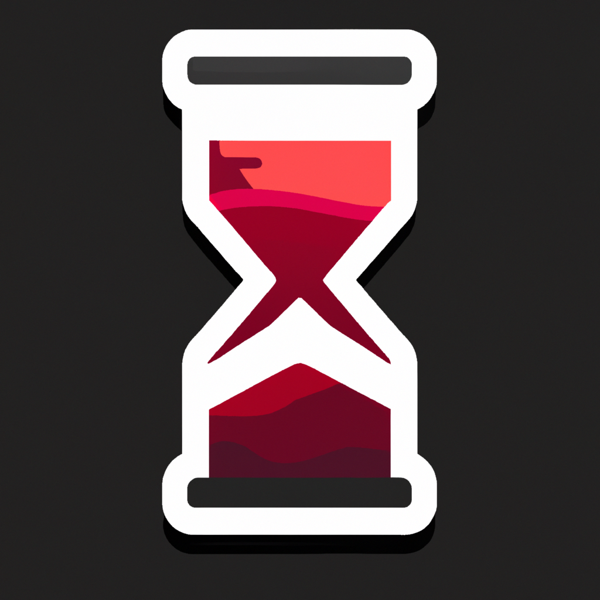
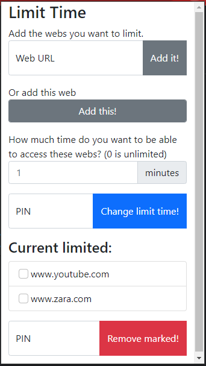

# Web Hourglass

Chrome extension to limit the time you spend in a list of domains.

## How to use

During the first usage the application will ask you for a PIN, this PIN will let you change the time and delete the domains you have restringed.

When you are on a webpage you want to restringe, you can simply click the button "Add this!" and it will add the current domain to the list. Otherwise, you can add manually the domains you want to restringe, using the format "www.example.com" and then clicking in "Add it!".

To set the minutes you want to be able to use those webs you can change the value in the corresponding input box and then indicating your PIN and clicking in "Change limit time!" button.

If you want to remove any domain from the restringed list, you can do it marking it and then indicating your PIN and clicking in "Remove marked!" button.

